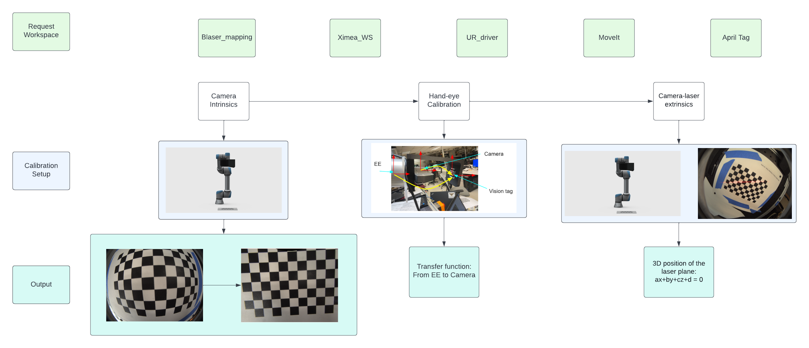
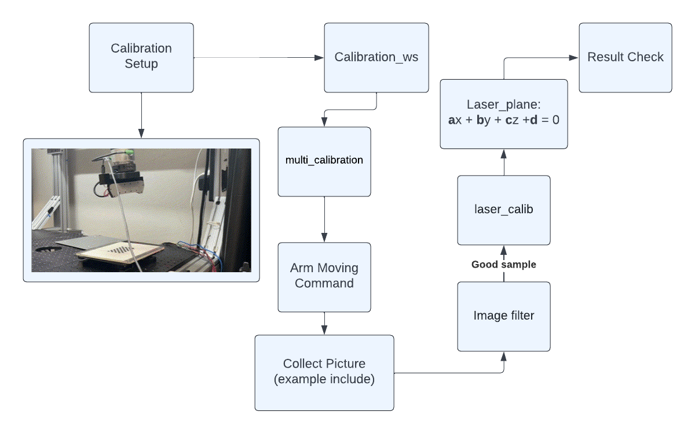

# Multi_Calibration
This repo combines camera intrinsics, hand-eye and camera-laser extrinsic calibration methods for the blaser sensor and the UR Robot arm



## 0. Installation
### 0.1 Environment
- Ubuntu 18.04 with ROS [Melodic](http://wiki.ros.org/melodic/Installation/Ubuntu). Comes with Python 2.7 and OpenCV 3.2
- Ubuntu 20.04 with ROS [Noetic](http://wiki.ros.org/noetic/Installation/Ubuntu). Comes with Python 3.8 and OpenCV 4.2.
### 0.2 Dependencies
1. [blaser_ros Melodic](https://github.com/biorobotics/blaser_mapping/tree/master/blaser_ros) / [blaser_ros Noetic](https://github.com/biorobotics/blaser_mapping/tree/tina/add-ubuntu20-compatibility/blaser_ros)
2. ximea_ros_cam (Install with the Blaser Dependencies)
3. [Universal_Robots_ROS_Driver
](https://github.com/UniversalRobots/Universal_Robots_ROS_Driver)
4. MoveIt  Melodic [Tutorials](http://docs.ros.org/en/melodic/api/moveit_tutorials/html/index.html)
/ MoveIt Noetic [Tutorials](https://ros-planning.github.io/moveit_tutorials/)
5. [apriltag_ros
](https://github.com/AprilRobotics/apriltag_ros)


Build the blaser_ros ws and the blaser_dependencies before proceeding.

Follow instructions in 0.3 to install other dependencies

### 0.3 Build Calibration Workspace 

Download the [install](https://github.com/Flowerst-0416/UR_arm_camera_calibration/blob/main/install) download scrip in the repo

To run the script,

```shell
chmod +x install
./install
```

catkin build several time (mostly three)

The calibration workspace should contain the following repo in the src:
* UR_arm_camera_calibration
* Universal_Robots_ROS_Driver
* MoveIt
* ximea_ros_cam
* camera_model
* apriltag

### 0.4 Configuring ximea_ros_cam
In `~/Calibration_ws/src/ximea_ros_cam/launch/example_cam.launch` change the value parameter to the serial number of your ximea camera

`<param name="serial_no"       type="string" value="your-camera-serial-no" />`

set the **num_cams_in_bus** to **1**

`<param name="num_cams_in_bus" type="int"    value="2"        />`

To change the **exposure_time** and **white_balance_mode** add the following line:
```shell
<param name="exposure_time" type="int" value="6000"/>
<param name="white_balance_mode" type="int" value="2"/>
```

Configure other camera params as needed
## 1. Camera Intrinsics

### 1.1 Hardware needed
* UR robot arm
* Camera holder ([Example](https://drive.google.com/file/d/12sZWZGFeq9ehgpnKUAZS80BMfkZedMsY/view?usp=sharing))

### 1.2 Calibration process

#### 1.2.0 Configure the Calibration Environment

To do the auto calibration, we need to firstly set the initial joint position for robot arm and the checker board origin position. To achieve that, go to `~/Calibration_ws/src/multi_calibration/cfg/trajectory_planner.yaml` and change the **homePositions** and **bedOrigin**.

#### 1.2.1 Image Collection
Open four terminal:
For the First one, connect the arm:
```shell
cd ~/Calibration_ws
source devel/setup.bash
roslaunch ur_robot_driver <robot_type>_bringup.launch robot_ip:=[robot ip]
```
For the Second one enable Moveit!:
```shell
cd ~/Calibration_ws
source devel/setup.bash
roslaunch ur5e_moveit_config ur5e_moveit_planning_execution.launch
```
For the Third one enable Ximea driver:
```shell
cd ~/Calibration_ws
source devel/setup.bash
roslaunch ximea_ros_cam example_cam.launch
```

For the Last one enable the auto_calibration:
```shell
cd ~/Calibration_ws
source devel/setup.bash
roslaunch multi_calibration auto_calibration.launch directory:="[file position]" camera_intrinsic:=1
```

#### 1.2.2 Calibration Process
Go to the folder where images collected from last step are saved
```shell
cd ~/Calibration_ws/intrinsic
rosrun camera_model Calibration -w 7 -h 10 -s 5 -i ./ -v --camera-model mei #use package camera_model to perform calibration. 
```
The camera model parameters will be saved to **camera_camera_calib.yaml**.

Use help **rosrun camera_model Calibration --help**  to see all the parameters.

Be careful about what camera model you use. For a narrow FoV camera without huge distortion, use **pinhole** model should suffice. If you use a large FoV camera with a lot of distortion, use **mei** or **kannala-brandt**. Typically you can try all the camera models and choose the one with the smallest reprojection error.

**Finally, examine the intrinsics parameters and result**

* Is the reprojection error reasonable? (should be at least < 1.0 px)
* Is fx and fy similar?
* Is cx and cy reasonable? cx ~ width / 2, cy ~ height / 2
* Is image height and width correct?

Update the calibration result to `~/Calibration_ws/src/multi_calibration/cfg/ximea_80_calib.yaml` 

After we finish the **MEI** model, we need to do the camera calibration for **PINHOLE** model.

Then, we do the do the calibration in PINHOLE model:

Launch the four terminals but instead of running auto_calibration in camera_intrinsic mode run it in camera_rect_intrinsic mode

```shell
cd ~/Calibration_ws
source devel/setup.bash
roslaunch multi_calibration auto_calibration.launch directory:="[file position]" camera_rect_intrinsic:=1
```

Go to the folder where images collected from last step are saved and run the pinhole calibration

```shell
source Blaser_ws/devel/setup.bash
rosrun camera_model Calibration -w 7 -h 10 -s 5 -i ./ -v --camera-model PINHOLE #use package camera_model to perform calibration. 
```

Update the pinhole calibration result (fx fy cx cy) to `rectCameraMatrix` in `~/Calibration_ws/src/multi_calibration/cfg/calib_params.yaml`

#### 1.2.3 Result Checking
To check the calibration result, run all the same four terminals with auto_calibration in camera_rect_intrinsic mode

```shell
cd ~/Calibration_ws
source devel/setup.bash
roslaunch multi_calibration auto_calibration.launch directory:="[file position]" camera_rect_intrinsic:=1
```

In another terminal window open rqt.

```shell
rqt
```

Go to Plugins -> Visualization -> Image Viewer

<p align="center">
    
</p>


In the Image Viewer panel switch to the `blaser_cam/image_rect_node` topic, this would display the undistorted image. All the straight lines in real world should appear as perfectly straight on the image.

<p align="center">
    
</p>

## 2. Hand-eye Calibration


### 2.1 Hardware needed
* UR robot arm
* Camera holder([Example](https://drive.google.com/file/d/1i7l1ikb1o2ocoi0iMsCJhSHDmBsIzraE/view?usp=sharing))
* April tag holder([Example](https://drive.google.com/file/d/12sZWZGFeq9ehgpnKUAZS80BMfkZedMsY/view?usp=sharing))
* [Hand eye calibration ipynb](Hand_eye.ipynb)

### 2.2 Calibration process
#### 2.2.1 Tag Size Measurement
The key to fiducial marker pose estimation is a correct estimate of the fiducial marker's actual size. To guarantee the precision of fiducial marker tag size, Photoshop editing and 100% print scale is recommended. 

Note: The tag size should not be measured from the outside of the tag. The tag size is defined as the distance between the detection corners, or alternately, the length of the edge between the white border and the black border. The following illustration marks the detection corners with red Xs and the tag size with a red arrow for a tag from the 48h12Custom tag family.

<p align="center">
    
</p>

#### 2.2.2 Tag Measurement
- Getting the *camera to Tag* transform: 
    
    - Start the ximea camera node

    ```shell
    cd ~/Calibration_ws
    source devel/setup.bash
    roslaunch ximea_ros_cam example_cam.launch 
    ```

    - In a new window run the auto_calibration.launch in handeye mode

     ```shell
    cd ~/Calibration_ws
    source devel/setup.bash
    roslaunch multi_calibration auto_calibration.launch hand_eye:=1

    ```
Now the **camera to Tag** transform can be viewed by echoing the **tf** rostopic.

- Getting the *end-effector to Tag* transform: Use the CAD of your April tag holder and Camera holder to obtain the transform.
#### 2.2.3 Calibration Process
After properly setting up the Apriltag pose estimation pipeline(that includes image undistortion and publishing updated rectified camera matrix), the **camera to Tag** transform should be available to you.

With the measurement of **camera to Tag** and **end-effector to Tag**, input them into 
[Jupyter Notebook for Hand-eye calibration](https://drive.google.com/file/d/1x8It3NmqM_Qm07OM-dieFRudrayFTtfS/view?usp=sharing) and get the **EE to Camera** transform matrix.

#### 2.2.4 Result Checking
As a sanity check for the calculation, the tag position derived from your **end-effector to Tag** transform and from **end-effector-camera-tag** transform chains should be exactly the same.

## 3. Camera-laser extrinsics
 
### 3.1 Hardware needed
* UR5e robot arm
* Camera holder([Example](https://drive.google.com/file/d/12sZWZGFeq9ehgpnKUAZS80BMfkZedMsY/view?usp=sharing))
* **Laser On**
* Laser calibration image([Example](https://drive.google.com/drive/folders/1YaM0gm-hhtI97vL1o1ijyLIKgfpJjhvY?usp=sharing))

The extrinsics parameters between camera and laser is the 3D position of the
laser plane in the camera reference frame, defined as $ax + by + cz + d = 0$. In
order to determine the plane's position, we take sample points from this plane
and then try to fit a 3D plane to these 3D points. We obtain sample points from
images of a checkerboard where the laser stripe is projected onto the
checkerboard. Since the checkerboard defines a 3D plane, we can get a 3D point
position for each 2D laser point on the image, which is the intersection between
the checkerboard plane and the line-of-sight ray.

We first need to make sure that the laser stripe detection is working. The laser
stripe detector basically performs an HSV filter with five parameters hue_min,
hue_max, sat_min, val_min, and val_ratio, defining a 3D range filter H in \[hue_low,
hue_high\], S in \[sat_low, 255\], and V in 
\[max(val_low, image_max_val * val_ratio), 255\]. Note that V range is dynamic 
and is set with every image.

When using red laser and you want a hue range containing the hue=180 value,
set hue_min > hue_max and the program will generate two separate hue ranges: 
one is \[hue_min, 180\] and the other is \[0, hue_max\]. 

To set these parameters, first use `python scripts/im_saver.py [image_topic]` to
save a couple of sample images, then use `python scripts/im_hsv_viewer.py
[image_file]` to determine the HSV value of the laser stripe and set appropriate
values for the threshold parameters. Load these values in a config file (todo
give example config and dir), which will be used in the calibration later.

To test these parameters, run `laser_stripe_detector` node with sample images
and the config file. (**todo turn on lsd visualization**).

In order to collect more image for laser calibration, please go to **cali_ws** and run the following code:

Open four terminal:
For the First one, connect the arm:
```shell
cd ~/Calibration_ws
source devel/setup.bash
roslaunch ur_robot_driver <robot_type>_bringup.launch robot_ip:=[robot ip]
```

For the Second one enable Moveit!:
```shell
cd ~/Calibration_ws
source devel/setup.bash
roslaunch ur5e_moveit_config ur5e_moveit_planning_execution.launch
```
Enable ximea driver in a new terminal:
```shell
cd ~/Calibration_ws
source devel/setup.bash
roslaunch ximea_ros_cam example_cam.launch
```

Next enable the auto_calibration in the laser_cam mode:
```shell
cd ~/Calibration_ws
source devel/setup.bash
roslaunch multi_calibration auto_calibration.launch directory:="[file position]" laser_cam:=1
```

```shell
cd ~/Calibration_ws/laser_calib
rosrun multi_calibration laser_calib -i ./ -c ./laser_calib.yaml
```